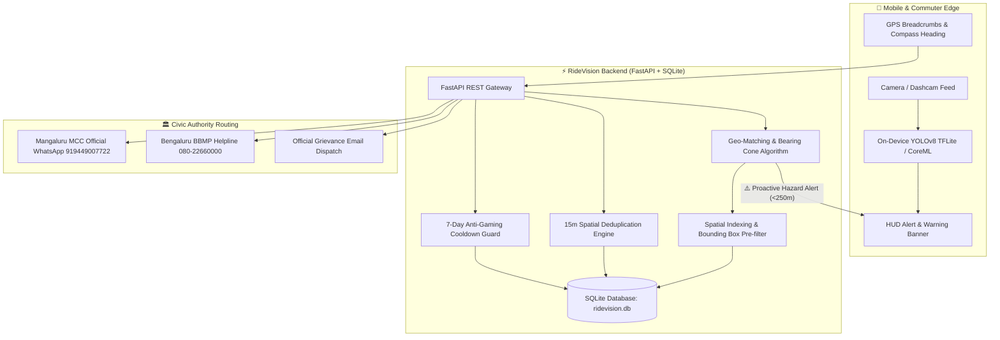

# RideVision 🚗💨 — CV-Based Pothole Detection & Proactive Safety System

> **Project-Based Learning (PBL) — Computer Vision & Civic Tech**  
> **Institution:** St Joseph Engineering College (SJEC) – Mangaluru  
> **Department:** Artificial Intelligence and Machine Learning (AIML)  
> **Course:** Computer Vision

RideVision is an end-to-end intelligent road safety platform that bridges the gap between daily commuters and municipal road authorities. Unlike traditional civic reporting apps that are purely manual, slow, and one-way, RideVision uses **on-device & server-side Computer Vision (YOLOv8)** to detect road hazards in real time, warns drivers of hazards **250m ahead** using a directional bearing cone, maintains a crowd-verified repair lifecycle with **anti-gaming cooldowns**, and automatically routes complaints to the official channel of the city (e.g. **MCC Mangaluru official WhatsApp**, **BBMP Bengaluru Helpline**).

---

## 🏛️ System Architecture



---

## 📁 Repository Structure

```text
RideVision_Project/
│
├── 01_Report/
│   └── PBL_Phase_1_Report_Filled.docx      # St Joseph Engineering College PBL Define Report
│
├── 02_Model_Training/
│   └── pothole_yolo_training.ipynb         # Colab training notebook for YOLOv8n + export
│
├── 03_Mobile_Android/                      # Complete Android Studio Project
│   ├── build.gradle.kts                    # Root build script
│   ├── settings.gradle.kts                 # Project settings & modules
│   ├── gradle.properties                   # JVM & AndroidX flags
│   └── app/
│       ├── build.gradle.kts                # CameraX, TFLite, Retrofit, Location services
│       └── src/main/
│           ├── AndroidManifest.xml         # Permissions (Camera, GPS, Network)
│           ├── assets/best.tflite          # Embedded YOLOv8n TFLite model (12.2 MB)
│           ├── java/com/ridevision/app/
│           │   ├── MainActivity.kt         # Live viewfinder, bounding box overlay, warning HUD
│           │   ├── PotholeDetector.kt      # TFLite inference engine (no-conflict core runtime)
│           │   └── api/RideVisionApi.kt    # Retrofit client for backend sync
│           └── res/
│               ├── layout/activity_main.xml# Modern Material dark UI
│               ├── values/                 # strings.xml, colors.xml, themes.xml
│               └── xml/                    # backup_rules, data_extraction_rules
│
├── 04_Mobile_iOS/                          # iOS Swift & CoreML Architecture
│   ├── ContentView.swift                   # SwiftUI interface with overlay bounding boxes
│   ├── PotholeDetector.swift               # CoreML + Vision framework inference wrapper
│   ├── LocationManager.swift               # CoreLocation GPS course/heading & hazard monitor
│   ├── NetworkService.swift                # URLSession backend client
│   └── Info.plist                          # Camera & Location privacy permissions
│
├── 05_Backend/                             # FastAPI Backend & Persistence
│   ├── main.py                             # Core REST endpoints (detect, report, trip, warning)
│   ├── database.py                         # SQLite schema, deduplication, Mangaluru/BLR seed data
│   ├── detector.py                         # Dedicated YOLOv8 deep learning edge inference engine
│   ├── geo_matching.py                     # Haversine distance, bearing cone, city geocoder
│   ├── requirements.txt                    # FastAPI, Uvicorn, Ultralytics, Torch, OpenCV
│   └── static/uploads/                     # Persisted hazard images
│
├── 06_Web_Dashboard/                       # Developer & Engineering Console
│   ├── app.py                              # Streamlit workbench (Inference, Drive Simulation, GIS Map, DB, REST, Viva)
│   └── samples/                            # Sample road photos (severe, moderate, clean)
│       └── generate_samples.py             # Road texture generator
│
├── tests/
│   └── test_system.py                      # Full automated test suite (7/7 unit & REST tests)
│
├── best.pt                                 # Trained YOLOv8 PyTorch model weights (6.2 MB)
├── best.tflite                             # Trained YOLOv8 TFLite model weights (12.2 MB)
├── app.py                                  # Root Streamlit launcher
├── run_dashboard.bat                       # 1-Click launcher for Web Dashboard
├── run_backend.bat                         # 1-Click launcher for FastAPI Server
└── README.md                               # Project documentation
```

---

## 🚀 Quick Start Guide

### Prerequisites
- Python 3.10 to 3.14 installed with pip.
- Dependencies installed:
  ```bash
  pip install fastapi uvicorn pydantic ultralytics torch opencv-python-headless pillow requests numpy streamlit pandas pydeck
  ```

### 1. Launch the Interactive Web Dashboard (Recommended for Demo & Viva)
Double-click `run_dashboard.bat` or run in terminal:
```bash
streamlit run app.py
```
Opens the application at `http://localhost:8501`.

### 2. Launch the FastAPI Backend Server
Double-click `run_backend.bat` or run in terminal:
```bash
python -m uvicorn main:app --app-dir 05_Backend --host 0.0.0.0 --port 8000 --reload
```
Interactive Swagger API docs available at: `http://localhost:8000/docs`.

### 3. Run Automated Tests
```bash
python tests/test_system.py
```

---

## 🌟 Key Features

### 1. 📸 Automated Computer Vision Detection
- Loads the trained `best.pt` (YOLOv8 nano) model for single-class pothole detection with post-NMS deduplication.
- Categorizes potholes into **Severe**, **Moderate**, or **Minor** based on bounding box dimension and frame area ratio.

### 2. 🚗 Proactive Driver Hazard Warning Ahead
- Evaluates commuter's current coordinates, heading ($\theta$), and speed against active road potholes.
- Checks if the hazard lies within **250 meters** and inside a **$\pm 45^\circ$ directional cone**:
  $$\delta = |\theta_{\text{heading}} - \theta_{\text{hazard}}| \pmod{360} \le 45^\circ$$
- Displays instant visual and audible head-up warnings before the vehicle reaches the hazard.

### 3. 🏛️ Municipal Complaint Routing (Civic Tech Integration)
- Automatically detects city jurisdiction via offline polygon bounds or geocoding:
  - **Mangaluru (MCC):** Routes directly to official WhatsApp (`wa.me/919449007722`) with prefilled GPS coordinates, Google Maps link, photo URL, and severity level.
  - **Bengaluru (BBMP):** Routes to BBMP 24x7 helpline (`080-22660000`) and Sahaaya portal.
  - Adding a new city requires only adding a row in the database table — **zero code changes**.

### 4. 🔄 Crowdsourced Verification & Anti-Gaming Cooldown
- Matches completed commuter trips against potholes within 25 meters.
- Prompts drivers: *"You passed near this pothole. Is it still there or fixed?"*
- Enforces a **7-day cooldown** per user per hazard to prevent spam voting or fake repair submissions.

---

## 📡 REST API Specifications

| Method | Endpoint | Description |
| :--- | :--- | :--- |
| `GET` | `/` | API status and engine health check |
| `POST` | `/api/detect` | Run CV inference on uploaded image frame |
| `POST` | `/api/potholes/report` | Submit report with auto-deduplication (15m radius) & city routing |
| `GET` | `/api/potholes` | Query registered potholes with optional city/status filters |
| `GET` | `/api/potholes/{id}` | Retrieve individual pothole details & routing links |
| `POST` | `/api/trip/check-ahead` | Real-time query for hazard within 250m ahead |
| `POST` | `/api/trip/complete` | Match completed route GPS breadcrumbs to passed-by hazards |
| `POST` | `/api/potholes/{id}/confirm` | Submit community confirmation vote (7-day cooldown enforced) |
| `GET` | `/api/municipal/route/{id}` | Retrieve WhatsApp/Helpline dispatch payload |
| `GET` | `/api/analytics/stats` | Aggregate civic safety & repair metrics |

---

## 🎓 PBL Viva Defense & Academic Notes

1. **Why use YOLOv8 nano rather than larger models?**  
   YOLOv8n has only ~3.2M parameters and an inference footprint of < 6.5 MB, making it capable of running at 30+ FPS on edge smartphones and embedded dashcams without causing device thermal throttling.
2. **How does RideVision handle water-filled potholes or rain?**  
   Water reflection and puddles are known CV edge cases. RideVision uses multi-frame temporal confirmation across consecutive frames before confirming a detection, backed by commuter verification.
3. **How is RideVision superior to sensor-only systems (e.g. ultrasonic / accelerometer)?**  
   - Sensor systems provide no visual evidence for municipal authorities to evaluate repair urgency.
   - Sensor systems lack a repair lifecycle, so repaired potholes trigger alarms indefinitely. RideVision solves this through crowd verification with cooldowns.
4. **How does deduplication work?**  
   Whenever a commuter files a report, the database searches for existing non-fixed potholes within a 15-meter Haversine radius. If found, it increments the confirmation counter rather than cluttering the civic dashboard with duplicate rows.
